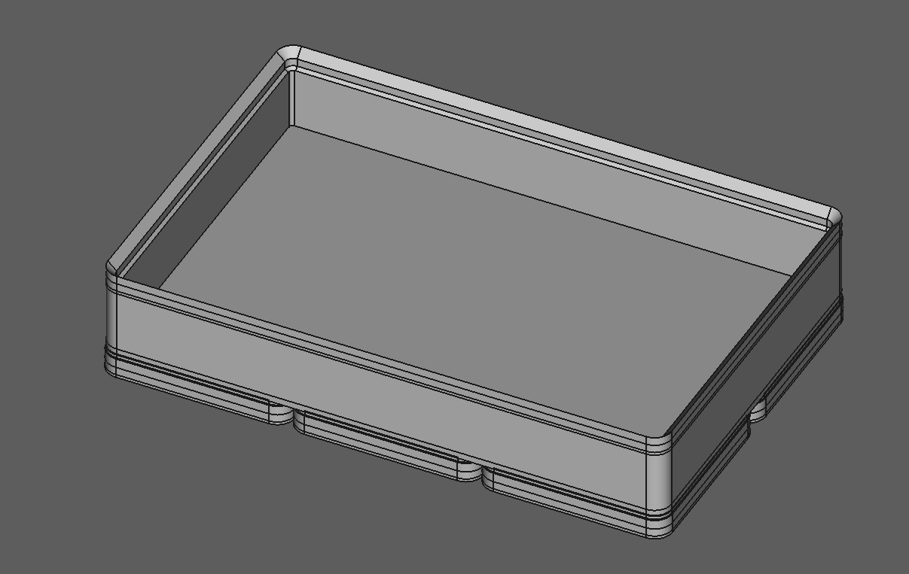
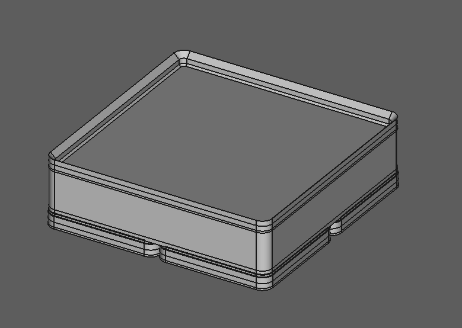

# FreeCAD Gridfinity Generator

A FreeCAD project that can create custom sized Gridfinity Baseplates and Modules with any number of columns, rows, or height units.

This project is based on the Gridfinity specification created by [Zack Freedman](https://github.com/zackfreedman), with attached design reference created by [willtree8](https://github.com/willtree8).

You can find out more about the Gridfinity project here: https://www.youtube.com/watch?v=ra_9zU-mnl8

And a usefull respository of starter objects at [gridfinity.xyz](https://gridfinity.xyz/).

## Gridfinity Generator

The FreeCAD project includes two main bodies: the Baseplate and the Module. Each body can be exported as required, or copied over to another FreeCAD project and further edited.

The Parameter spreadsheet includes all values that can be edited to create the custom sized baseplates and modules. All values are **Integer** type.

| Parameter | Description | Range |
|---|---|---|
| Columns | The number of columns wide | > 0 |
| Rows | The number of rows tall | > 0 |
| Wall Height Units | The number of height units tall to make the module walls | > 0 |
| Floor Height Units | The number of height units tall to make the floor | >= 0, <= Wall Height Units |

The Gridfinity specification measures the height of the modules in height units, which work out to multiples of 7mm. The base of each Module plus the top lip also total to 7mm, so individual modules of varying sizes can be stacked consistently. The **Wall Height Units** in the Parameters spreadsheet specifices how many multiples of 7mm tall to make the bin walls.

The **Floor Height Units** is the number of height units tall that the floor of the bin should be, measured from the top of the module floor. Settings this value to 0 will create a fully cut out bin, while a value equal to the number of **Wall Height Units** in the Parameters spreadsheet will create a "blank" bin. This bin is useful in creating custom objects using a Boolean Delete (or similar operation) to cut out the profile of the item you would like to store.

### Examples

#### 3x2x2 Bin

| Parameter | Value |
|---|---|
| Columns | 3 |
| Rows | 2 |
| Wall Height Units | 2 |
| Floor Height Units | 0 |

#### 2x2x2 Blank

| Parameter | Value |
|---|---|
| Columns | 2 |
| Rows | 2 |
| Wall Height Units | 2 |
| Floor Height Units | 2 |

